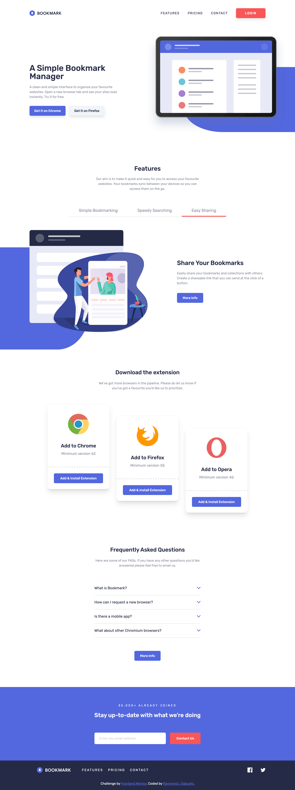

# Frontend Mentor - Bookmark landing page solution

This is a solution to the [Bookmark landing page challenge on Frontend Mentor](https://www.frontendmentor.io/challenges/bookmark-landing-page-5d0b588a9edda32581d29158). Frontend Mentor challenges help you improve your coding skills by building realistic projects. 

## Table of contents

- [Overview](#overview)
  - [The challenge](#the-challenge)
  - [Screenshot](#screenshot)
  - [Links](#links)
- [My process](#my-process)
  - [Built with](#built-with)
  - [What I learned](#what-i-learned)
  - [Continued development](#continued-development)
  - [Useful resources](#useful-resources)
- [Author](#author)

## Overview

### The challenge

Users should be able to:

- View the optimal layout for the site depending on their device's screen size
- See hover states for all interactive elements on the page
- Receive an error message when the newsletter form is submitted if:
  - The input field is empty
  - The email address is not formatted correctly

### Screenshot

### Links

- Solution URL: [https://github.com/Ihezie/bookmark-landing-page.git](https://github.com/Ihezie/bookmark-landing-page.git)
- Live Site URL: [https://musical-moxie-bab6e3.netlify.app/](https://musical-moxie-bab6e3.netlify.app/)

## My process

### Built with

- Semantic HTML5 markup
- CSS custom properties
- Flexbox
- CSS Grid
- Mobile-first workflow
- [React](https://reactjs.org/) - JS library
- [tailwindCSS](https://tailwindcss.com/) - CSS library
- [framer-motion](https://www.framer.com/motion/) - Animation Library

### What I learned
This project was tasking for me to complete not because it was inherently difficult, but because of the variety of animations I took upon myself to add. During this project, I got to practice using the framer-motion animation library to implement scroll and state-triggered animations. The result is smooth user-friendly animations, that complement the general aesthetic of the site quite nicely. Also, my CSS layout skills were lightly challenged by this project. All in all, I would say this project improved my web design skills substantially.

### Useful resources

- [Example resource 1](https://www.freecodecamp.org/news/regular-expressions-for-beginners/) - This article helped me understand regular expressions, which I used for email validation in the Contact Us section.

## Author
- Frontend Mentor - [@Ihezie](https://www.frontendmentor.io/profile/Ihezie)
